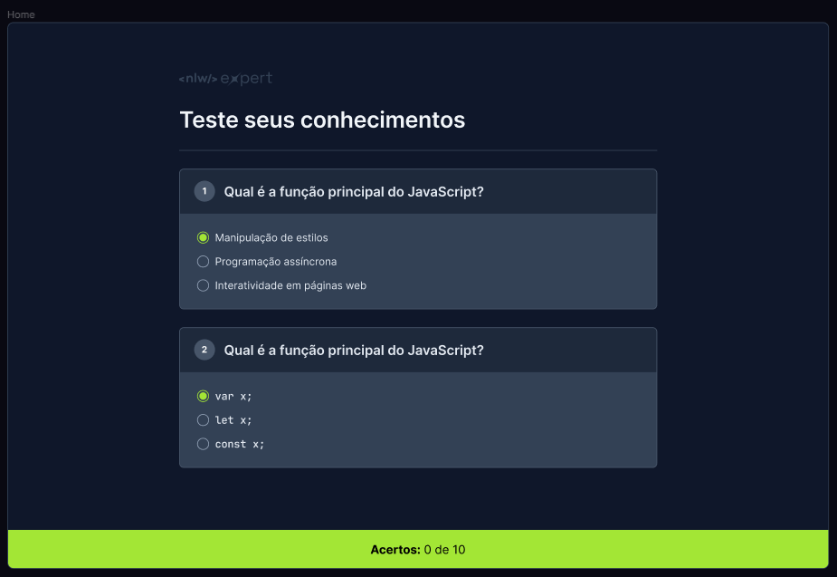
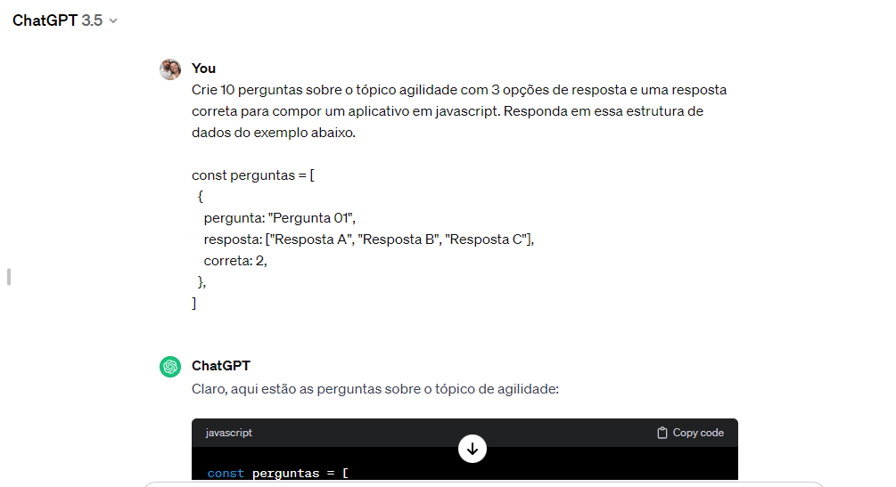
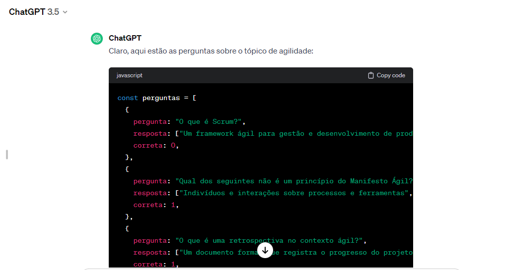

<h1 align="center"> Projeto QUIZ </h1>

Programa exclusivo promovido pela Rocketseat para ensino de tecnologias WEB, evento NLW Expert.

  <a href="#-tecnologias">Tecnologias</a>&nbsp;&nbsp;&nbsp;|&nbsp;&nbsp;&nbsp;
  <a href="#-projeto">Projeto</a>&nbsp;&nbsp;&nbsp;|&nbsp;&nbsp;&nbsp;
  <a href="#-layout">Layout</a>&nbsp;&nbsp;&nbsp;|&nbsp;&nbsp;&nbsp;
  <a href="#memo-licença">Licença</a>

  

 

   
   
  

## 🚀 Tecnologias

Esse projeto foi desenvolvido com as seguintes tecnologias:

- HTML, CSS e JavaScript
- Git e Github
- Figma

## 💻 Projeto

O projeto site Quiz é uma pagina simples, para treino de HTML, CSS, JavaScript e responsividade.

## 🔖 Layout

Você pode visualizar o layout do projeto através [DESSE LINK](<https://www.figma.com/file/8IwtP4O1ViDZipzDcvz7Il/NLW-expert-%E2%80%A2-Quiz-(Community)?type=design&node-id=186-114&mode=design&t=Ijg45tdqHHBcMr3M-0>). É necessário ter conta no [Figma](https://figma.com) para acessá-lo.

## :memo: Licença

Esse projeto está sob a licença MIT.

---

Feito com ♥ by Rocketseat :wave: [Participe da nossa comunidade!](https://discord.gg/rocketseat)
